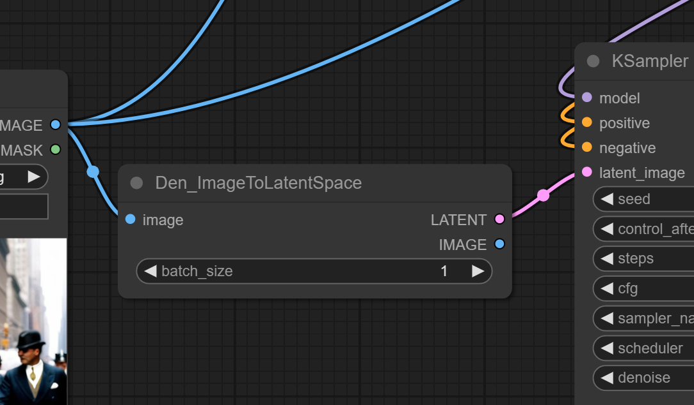
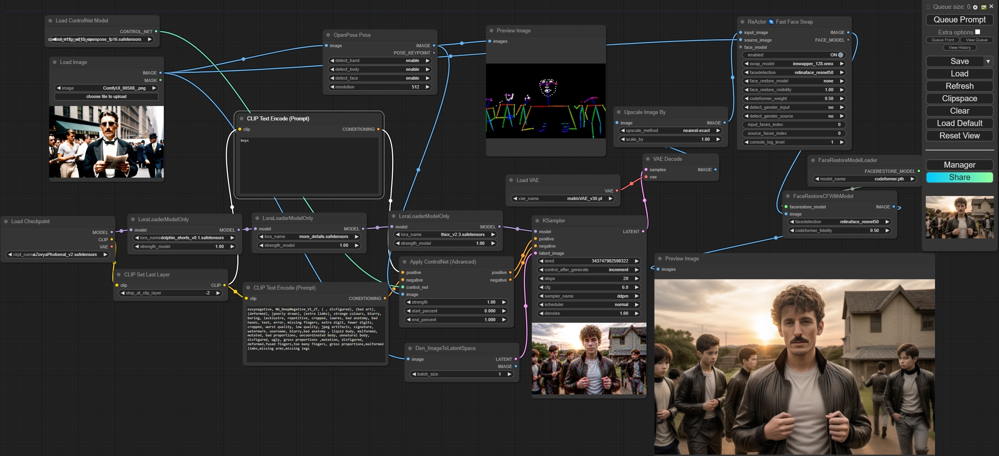
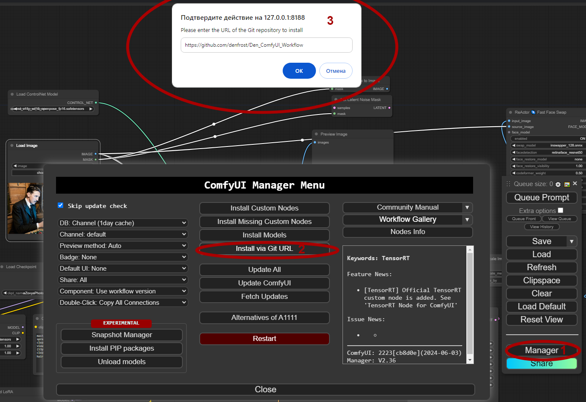

Den_ComfyUI_Workflows
==============
Custom nodes make easy Advanced Workflows. 
Focus on Image\Video and ControlNet efficiency and performances.
Manipulation of Latent Space, Automatic pipeline with a bit efforts.
--------------
#### SD Video: `Den_SVD_img2vid`

- SVD from size Image for init Latent Space SVD Model

#### ImageToLatent node: `Den_ImageToLatentSpace`

- Latent space from size Image

--------------

--------------
How Install. Manager->Install via Git URL -> Enter Git Address 
